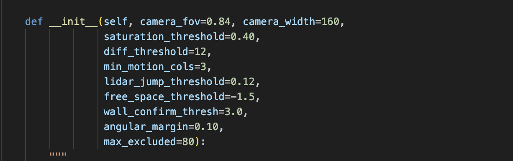
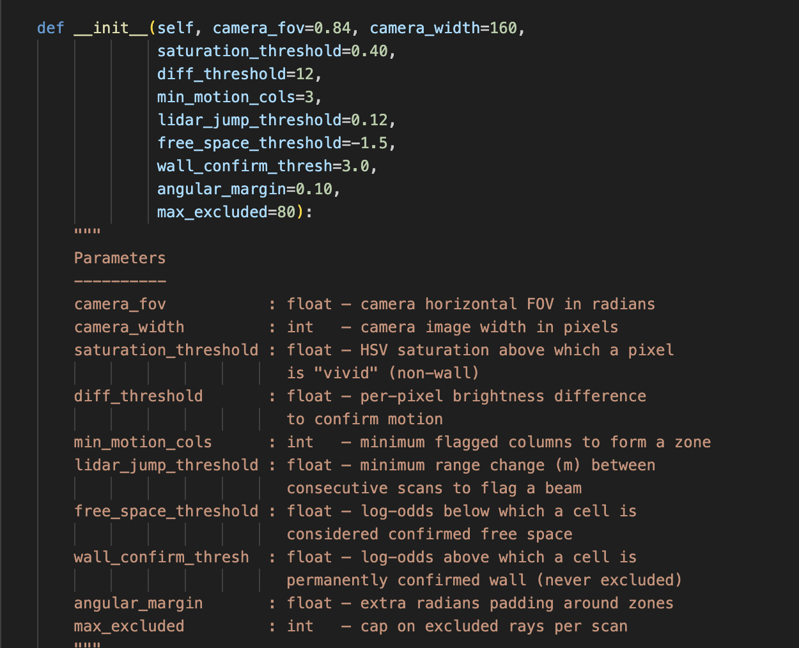

# Perception of Cognitive Robots: Milestone 3 🤖🗺️

**An autonomous, from-scratch SLAM, Path Planning, and Computer Vision pipeline for the Webots E-puck robot.**

This repository contains the Milestone 3 submission for the Perception of Cognitive Robots course. The core philosophy of this project is **algorithmic purity**: no external robotics, path-planning, or computer vision libraries (such as ROS, OpenCV, Scikit-Image, or GTSAM) were used for the mathematical logic. Everything from ray-tracing and state estimation to color space conversion was built entirely from scratch using standard Python `math` and `numpy`.

---

## 🆕 Milestone 3 Improvements

### 1. Graph-Based Map (replaces fixed arrays)
* **Sparse Dictionary Graph:** The occupancy map is now a `dict` keyed by `(col, row)` grid coordinates — no pre-allocated numpy array, no hardcoded world size.
* **Arbitrary Starting Position:** The graph grows dynamically as the robot explores. There are no GPS offset assumptions — the robot can start anywhere in any arena.
* **Graph A\* Planner:** The A* path planner operates directly on the sparse graph structure with set-based C-Space inflation, instead of numpy array operations.
* **Scrolling Viewport Display:** The PyGame dashboard uses a robot-centred scrolling viewport that follows the robot through the unbounded map.

### 2. Camera + LiDAR Fusion for Moving Object Detection
* **Colour-Independent Motion Detection:** Instead of relying on HSV colour thresholds, the camera uses frame-to-frame differencing with ego-motion compensation (median subtraction) to detect independently-moving regions — works regardless of object colour.
* **LiDAR Map-Consistency Check:** LiDAR rays that hit in cells the graph map marks as "confirmed free space" (strongly negative log-odds) are flagged as potential dynamic objects.
* **Sensor Fusion:** A ray is classified as a moving object when:
  - Its bearing matches a camera-detected motion zone AND the LiDAR hit is in known-free space (both sensors agree), OR
  - The LiDAR hit is in very-strongly-free space (fallback for objects outside camera FOV).
* **Map Exclusion:** Rays classified as hitting moving objects are excluded from map updates, preventing phantom walls.

---

## 🌟 Key Features & System Architecture

### 1. Probabilistic Mapping & SLAM
* **Log-Odds Occupancy Graph:** Calculates Bayesian log-odds probabilities using a sparse graph to build a robust 2D map, filtering out sensor noise over time.
* **Custom Ray-Tracing:** Implements Bresenham's Line Algorithm from scratch to trace LiDAR rays and accurately mark "free space" between the robot and detected obstacles.
* **Extended Kalman Filter (EKF) Fundamentals:** Engineered matrix math (Jacobians, covariance updates, Mahalanobis distance) to track probabilistic landmarks and manage pose uncertainty.

### 2. Autonomous Navigation (A* & Exploration)
* **A* (A-Star) Global Path Planning:** A purely mathematical graph planner that calculates the optimal route to the goal. It intelligently treats "unknown" (unmapped) space as walkable, driving the robot to actively explore the maze.
* **C-Space Inflation:** Solves the "1-Pixel Robot Fallacy" by artificially inflating mapped walls by 3 grid cells using set-based dilation. This forces the A* algorithm to route the physical E-puck safely down the center of hallways rather than scraping corners.
* **Reactive Emergency Override:** A low-level hardware safety loop that constantly monitors raw LiDAR. If the robot gets snagged on a tight corner, it temporarily bypasses A*, forcing a multi-phase recovery sequence.

### 3. Computer Vision & Sensor Fusion
* **Frame-Differencing Motion Detection:** Colour-independent camera-based motion detection using temporal frame differencing with ego-motion compensation.
* **Scan-to-Map Consistency:** Compares live LiDAR hits against the established occupancy graph to identify objects in known free space.
* **Multi-Sensor Fusion Pipeline:** Combines camera motion zones with LiDAR map-consistency checks to reliably identify and exclude moving objects from map creation.
* **Vectorized Color Space Conversion:** Converts raw RGB camera feeds to HSV space for UI object labelling (GOAL, BALL markers).

### 4. Custom PyGame UI Dashboard
* **Scrolling Viewport:** A robot-centred viewport that follows the robot through the unbounded graph map, showing the trajectory, obstacles, and A* path.
* **Dual-Panel Live Rendering:** Map view + camera feed with bounding boxes over detected targets.
* **Dynamic Object Status:** Displays real-time count of rays excluded by the dynamic filter.

---

## 📂 File Structure

### Core (Milestone 3)
* `slam_controller.py` — Main execution loop. Initializes hardware, integrates mapping, planning, and dynamic filtering.
* `graph_map.py` — **NEW** Sparse graph-based occupancy map using dict. Replaces the fixed numpy array.
* `graph_planner.py` — **NEW** A* planner operating on the sparse graph with set-based inflation.
* `dynamic_filter.py` — **NEW** Camera + LiDAR fusion for colour-independent moving object detection.
* `exploration.py` — Manages the state machine for A*-guided navigation and wall recovery.
* `map_display.py` — **UPDATED** Scrolling viewport PyGame display + camera feed panel.

### Supporting (retained from Milestone 2)
* `occupancy_grid.py` — Original fixed-array occupancy grid (retained for reference).
* `path_planning.py` — Original array-based A* planner (retained for reference).
* `ekf_slam.py` — Extended Kalman Filter (retained, not actively used).
* `landmark_extraction.py` — Split-and-Merge LiDAR processing.
* `camera_display.py` — Standalone camera display module (superseded by map_display).
* `utils.py` — Core math helpers (angle normalisation, Euclidean distance).

### Worlds
* `worlds/Graph_Test.wbt` — **NEW** 8×8m test arena for graph-based mapping (robot starts at corner).
* `worlds/Slam_Maze.wbt` — Original 6×6m maze arena.

---

## 👥 Team Members
Panapon (6638114021)

Kittibhum (6638018521)

Nuntis (6638103121)


Course: 2147331.i Perception of Cognitive Robots — Chulalongkorn University

---
### 🧠 1. Sensor Fusion Configuration



These snippets highlight the engine behind our new Camera-LiDAR fusion pipeline. Instead of relying on black-box libraries, the 3-signal logic was manually programmed from scratch. Key parameters include `diff_threshold` for camera frame-differencing (Signal 1), `lidar_jump_threshold` for scan-to-scan range jumps (Signal 2), and `free_space_threshold` for the map consistency check (Signal 3).

---

### 🎯 2. Live Dashboard & Active Dynamic Filtering


This demonstrates the entire system functioning flawlessly in real-time. On the right, the camera successfully identifies the moving magenta ball. On the left, our new scrolling viewport renders the Graph Map. The most critical metric is at the bottom: **`DYN: 77 rays excluded`**. This is absolute visual proof that the dynamic object filter is actively catching the moving ball and rejecting those LiDAR rays to keep the static map perfectly clean.

---

### 🗺️ 3. The Graph-Based Map Proof


This proves our transition away from fixed, bounded NumPy arrays. Looking at the Webots console output, the **`nodes=`** value continuously grows as time passes (scaling from 10,229 up to over 15,016). Because a standard array is a fixed grid, its size never changes. This dynamically increasing node count proves the map is functioning as a flexible Dictionary Graph, allowing the robot to map an unbounded environment without relying on hardcoded GPS offsets!


## 🚀 How to Run the Simulation

**1. Prerequisites:**
You will need Webots (R2025a or compatible) installed on your machine. You also need to install the two required Python libraries for math and UI rendering:
```bash
pip install numpy pygame
```
**2. Launching:**

**Test the graph-based system (recommended first):**
Open `worlds/Graph_Test.wbt` in Webots. The robot starts at `(-3, -3)` in an 8×8m arena with the goal at `(3, 3)`.

**Run the full maze:**
Open `worlds/Slam_Maze.wbt` in Webots. Ensure `TARGET_X` and `TARGET_Y` in `slam_controller.py` are set to `(2.5, 2.5)`.

In both cases: ensure the E-puck's controller is set to `slam_controller`, then hit Play. The PyGame dashboard will launch automatically.
